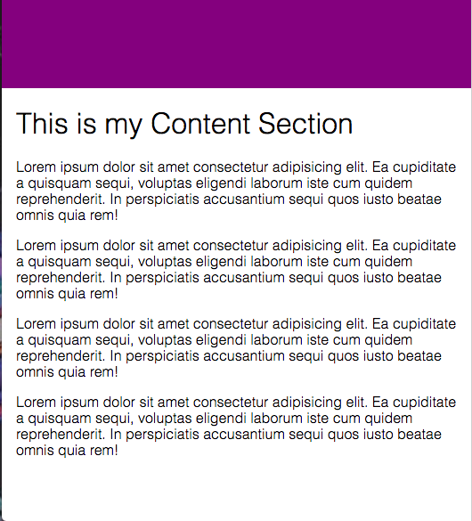
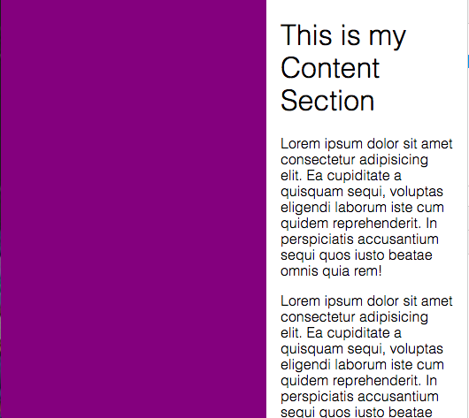

# FlexBox---MediaQueries
What are Media Queries? 
Media queries are used for styling our websites differently depending on the dimensions of the window.

Typical Device Breakpoints
/* Extra small devices (phones, 600px and down) */
@media only screen and (max-width: 600px) {...} 

/* Small devices (portrait tablets and large phones, 600px and up) */
@media only screen and (min-width: 600px) {...} 

/* Medium devices (landscape tablets, 768px and up) */
@media only screen and (min-width: 768px) {...} 

/* Large devices (laptops/desktops, 992px and up) */
@media only screen and (min-width: 992px) {...} 

/* Extra large devices (large laptops and desktops, 1200px and up) */
@media only screen and (min-width: 1200px) {...}

